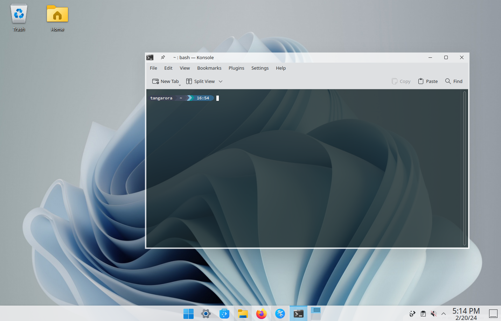
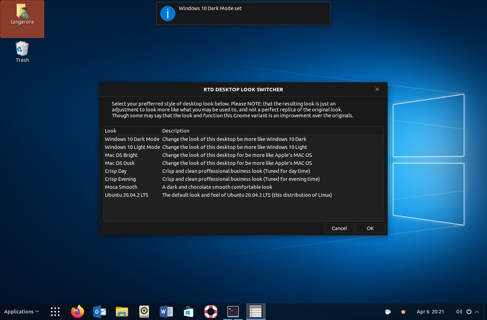
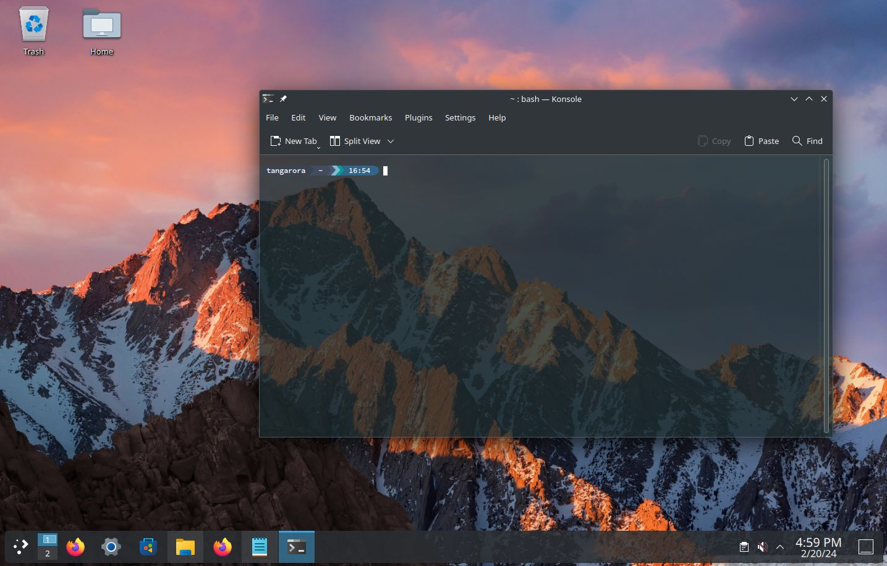
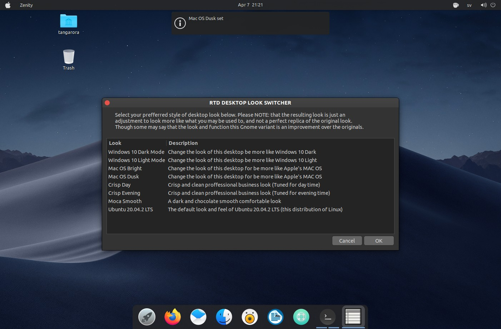

# Plus-Themes

Plus Themes is a theme installer for linux. It can install preconfigured themes for GTK (Gnome where they do not resist), KDE Plasma, Icons, Fonts and bash themes.

1. Bash Theme - Starship enabled bash environment and a cool prompt
2. KDE Themes
3. Gnome Themes (GTK)
4. Fonts - A selection of Nerd Fonts from [nerdfonts.com](https://www.nerdfonts.com/ "See all available fonts and glyphs")
5. Icons for KDE and Gonome
6. Sounds - some fun sounds from the past

## Samples of themes:

---

|  |  |
| -------------------------------------------------------- | --------------------------------------------------- |
|      |      |

---

